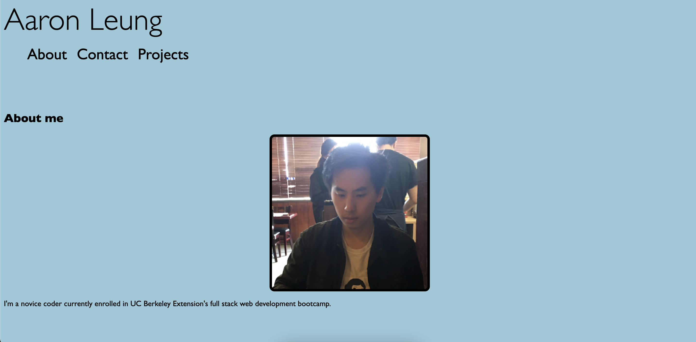

# Portfolio

Portfolio created to showcase my projects for the full-stack coding bootcamp for UC Berkeley Extension.

## Technologies Used
Created using HTML and CSS.

Here's a sample image: 

And you can view the deployed app [here](https://aaronhleung.github.io/hw2-portfolio/) on GitHub Pages!